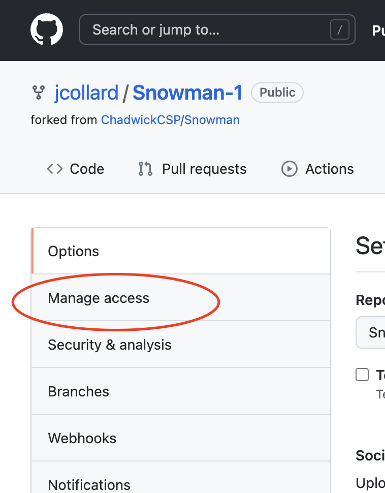
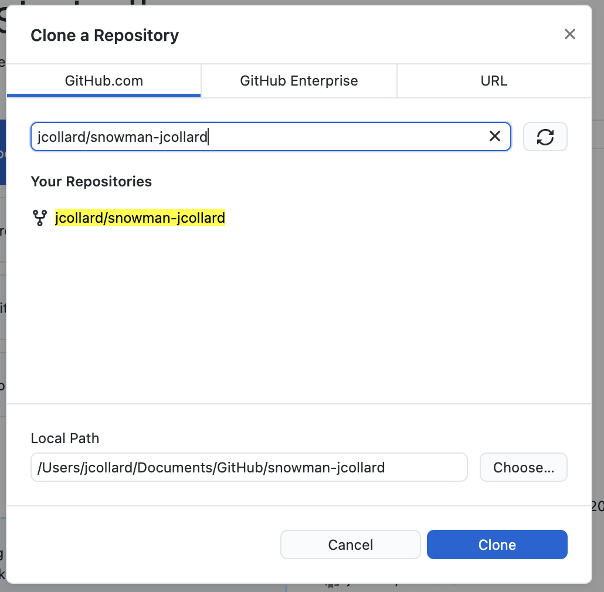
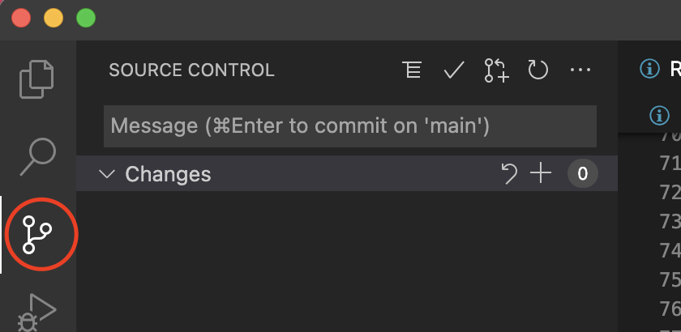
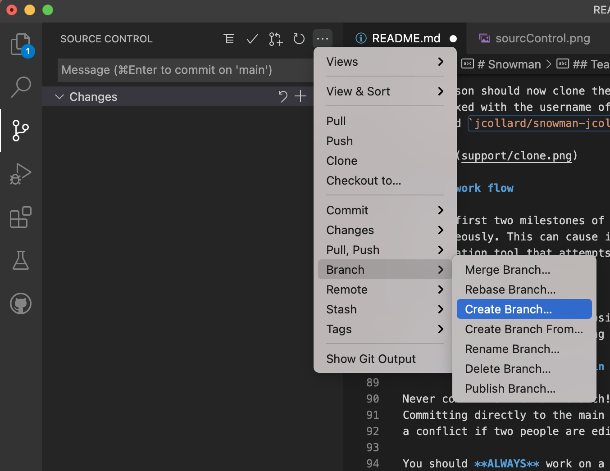
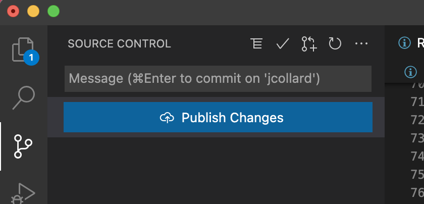

# Snowman

In this project, you will implement an interface for creating a Word Guessing
game. Then, using that library, you will implement a Guessing Game called
"Snowman" in Unity.

## Required Software

### .NET Core Test Explorer

This plugin allows you to quickly run C# Unit tests inside VS Code.

Get it from the VS Code Market Place:
[LINK](https://marketplace.visualstudio.com/items?itemName=formulahendry.dotnet-test-explorer)

### Markdown All in One

This plugin adds a bunch of nice features for writing Markdown.

Get it from the VS Code Market Place:
[LINK](https://marketplace.visualstudio.com/items?itemName=yzhang.markdown-all-in-one)

### Unity 2020.3.21f / Unity Hub

You should download an install Unity Hub and Unity 2020.3.21f as homework.

Coming soon: A video on completing the Unity installation

## Project Setup

### Fork Repository

For previous projects, you have signed up for the project using GitHub
classroom. This is not a normal work flow in the software development world. For
this project, you will be creating a forked repository. A forked repository
can be thought of a copy of the repository that contains the entire history
of the project that can later be merged back together.

To start out, 1 member from your group should fork the main repository.

### Manage Access

After the fork has been created. The member who forked it should update the repository
so that each member of the group can access it.

1. Click Settings

2. Rename your repository to be `snowman-username1-username2-username3`.
    * For example, Mx. Collard (jcollard) and Mr. DeVaughn-Brown (jd12) would rename their repository: `snowman-jcollard-jd12`

3. Click Manage Access

4. Add People

5. Add `jcollard` as well as your other group members. This will be their GitHub username.

6. Each member will receive an email with the invitation that they will need to accept.

### Clone Repository

Each person should now clone the repository to their computer. The name of the repository will
be prefixed with the username of the member who forked the repository. For example, Mx. Collard's fork
is called `jcollard/snowman-jcollard`.

## Team work flow

For the first two milestones of this project, you and your group members will be working on the project
simultaneously. This can cause issues if you are modifying the same files at the same time. Git is a powerful
collaboration tool that attempts to make this easier.

### What is a Branch

A branch is a copy of the repository that allows for code to be edited in isolation, tested, and then either
combined or discarded depending on the results. 

### Disallow committing to main branch

Never commit to the main branch! The main branch should always contain the most recent, agreed upon project.
Committing directly to the main branch can cause major issues for your whole team. The most common iss
a conflict if two people are editing the same file at the same time.

You should **ALWAYS** work on a separate branch and later have your work merged via a pull requests when you're
ready to combine your work.

TODO

### Creating a Branch

For this project, each group member will have their own branch.

Create a branch that matches your name. This is the branch where you will do all
of your own work.

1. Click on the source control icon in VS Code

2. Select the `...` Menu > Branch > Create Branch ...

3. Your branch name should be the first part of your email address. For example, `jcollard`
    * **Do not click Publish Changes yet!**

4. Add your name to the `Authors` Section of the WordGuesser/README.md document.
   * Note: Only add your individual name, do not add your entire teams name.

5. Commit your change.

6. Click Publish Changes

### Create a Pull Request

At this point, your changes are local to your branch. That is, your name is not visible on any other branch.

To combine work together using git, we perform a merge. Typically, this is done using a Pull Request. This is a feature
that GitHub provides. For now, we will create a Pull Request using GitHubs interface (note: you can also do this directly in VS Code).

1. Go to your group's project on GitHub.
2. Click the `Pull Requests` tab

3. Click `New Pull Request`

4. Make sure the target repo on the left is your project.

5. Select that you want to merge to `main` from `your-branch`

### Merge a Pull Request

Go to your group members pull request. Add a comment. Approve their pull
request.

### Merging Main into your Branch

TODO: Show how to merge main into branch

## Create a Feedback Pull Request

Create a pull request from your `main` branch to the `ChadwickCSP/main` branch.
Add Mx. Collard as a reviewer.

This is where you will receive feedback from Mx. Collard.

## Milestone 1

* E Period Due: Wednesday Nov. 3rd @ 11:59 PM 
* C Period Due: Thursday Nov. 4th @ 11:59 PM

Complete flowcharts and design document

## Milestone 2

* E Period Due: Monday Nov. 8th @ 11:59 PM 
* C Period Due: Tuesday Nov 9th @ 11:59 PM

Complete Word Game

## Milestone 3

* E Period Due: Wednesday Nov 10th @ 11:59 PM 
* C Period Due: Thursday Nov 11th @ 11:59 PM

Setting up Unity Coming Soon!

## Milestone 4

* E Period Due: Wednesday Nov 17th @ 11:59 PM 
* C Period Due: Thursday Nov 18th @ 11:59 PM

Complete the Snowman Game Coming Soon!

## Milestone 5

* E Period Due: Thursday Nov 18th
* C Period Due: Friday Nov 19th

Complete Written Response

Coming Soon!